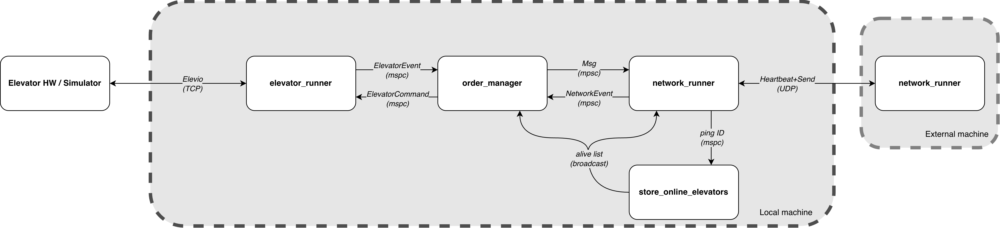
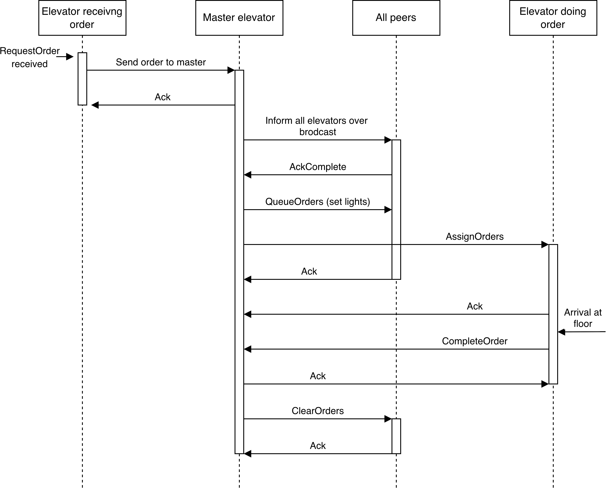

## Design Description

Our elevator controller is written in Rust, running on the Tokio async runtime. It has a Master-Slave topology, communicating over UDP. The architecture consists of four concurrent Tokio tasks spawned from `main.rs`, connected exclusively through channels.

**Tasks and their roles:**

- **`elevator_runner`**: Interfaces with the elevator hardware (or simulator) via the Elevio TCP protocol. Spawns sub-tasks for polling sensors, a motor controller and a light controller. Issues `ElevatorEvent`s (button presses, state updates, order completions) and receives `ElevatorCommand`s (assign order, set light).
- **`network_runner`**: Handles all UDP communication: heartbeat pings, and a two-layer reliable transport for messages. Routes outbound messages based on role (master sends out to all peers and slave sends only to master).
- **`order_manager`**: The central decision-maker. Maintains the order queue, current assignments, elevator positions, and role (master/slave). Translates between elevator events, network events, and the assignment logic.
- **`store_online_elevators`**: Merges heartbeat pings into a membership list using a `BTreeMap<id, Instant>` with a 3-second timeout. Broadcasts the sorted alive list to both the network and order manager tasks.

The Elevio driver was originally blocking. We moved polling into async Tokio tasks (`poll.rs`) with 25 ms sampling, while keeping TCP I/O (`elev.rs`) synchronous behind `Arc<Mutex<TcpStream>>`. This gives concurrent sensor polling, motor control and light control, with clear task boundaries.

**Master election and failover:**
The elevator with the lowest ID acts as the master. A debounce timer ensures that pings have been received from all alive peers before master election.
The new master then redistributes all orders. 

**Fault tolerance mechanisms:**
An order watchdog (15 s) re-queues stuck assignments. An idle watchdog (3 s) prompts the master to assign queued work to idle elevators. Lost elevators have their current orders put back into the assignment pipeline. A receive-side deduplication window (3 s) prevents double-processing of the same message. On panic, the process aborts immediately.

*Figure 1: Module interaction diagram.

<!-- FIGURE 2: Order lifecycle (replace with actual figure) -->

*Figure 2: Order lifecycle*

## Case Study 1: Custom Order Assignment Module

### The decision

We built a custom assignment module in `assignment.rs` instead of the provided cost-function assigner. We wanted explicit per-order control in the master and fast replanning when state changes (obstruction, direction changes, peer loss). Each elevator is assigned to one active order and receives the next from the master upon completion.

### What we implemented
The master executes order assignment, synchronizes the uncompleted-order list with peers, and instructs selected elevators to serve each order. The flow is shown in Figure 2:

1. Elevator informs master of button press.
2. Master informs all peers of the order.
3. All peers receive order
3. Master informs peers order is to be served, with `QueueOrders` 
5. The master sends `AssignOrders` to the selected elevator.
6. Elevator completes order and sends `CompleteOrder`
7. Master informs peers to `ClearOrders`

When a new order arrives, `assign_new_order` designates busy and idle elevators, then applies two strategies in sequence:

1. **Interruption** (`pause_order`): If a busy elevator is currently traveling past the new hall call "on the way" (determined by `order_on_the_way`, which checks floor ordering and call direction), its current order is stashed at the front of the queue and the new order is assigned instead. This avoids the elevator ignoring a stop it could have served.

2. **Closest idle** (`find_closest_elev`): Among idle elevators, pick the one minimizing `abs_diff(floor, order.floor)`.

After an order is completed, `assign_next_order` selects the next order. It prefers cab orders in the current travel direction, checks whether a direction reversal is warranted, and refines the choice with `find_closest_order_otw` to pick the nearest eligible "on the way" order. The queue itself is structured with cab orders before hall orders (`rebuild_queue`).

Queue changes are broadcast to peers using `QueueOrders` and `ClearOrders`.

### Alternative not chosen

A cost-function assigner would score each elevator for each new hall order and pick the minimum score. We did not choose this because we prioritized deterministic rule-based behavior, unified hall/cab handling in one module, and explicit queue control over weight tuning.

### Why we chose our approach

Assigning one order at a time shifts complexity from elevators to the master. Elevators only execute commands and report completion. A key reason for this design is unified order handling: hall and cab orders are managed in one module with one decision flow.

### Reflection

Building the module from scratch gave a big learning benefit, but 
using the provided cost function would 
be simpler and likely reduce complexity. Still, a 
custom system gave increased control of order management behaviour. 

We spent substantial time evaluating control flow to cover scenarios, with more testing and bug fixing than we likely would have needed with a cost-function approach. We still consider this effort worthwhile for completeness, because we wanted to develop the entire project ourselves (except Elevio).

The remaining tradeoff is maintainability: new behavior usually means more branching logic instead of one extra score term. The benefit is traceability; all order decisions are centralized in `assignment.rs` and explainable from explicit rules in logs/code paths.

## Case Study 2: Reliable UDP with Two-Layer Acking

### The decision

We built a custom reliable transport over UDP rather than using TCP or an existing messaging library.

### What we implemented

The transport has two layers:

**Layer 1: Per-datagram reliability** (`transport.rs`): Each `Msg` is wrapped in a `Frame::Data { seq, msg }` and serialized with bincode. The sender retries every 5 ms until it receives a `Frame::Ack` matching both the sequence number *and* the full message content, or gives up after a set amount of attempts. The receiver sends three copies of each ACK to reduce ACK-loss probability. Each send spawns its own Tokio task with its own UDP socket, so multiple reliable sends proceed concurrently.

**Layer 2: Confirming message arrival to all peers** (`networking.rs`, `pending.rs`): Each message is assigned a sequence number and a `PendingMap` entry tracking which peers must ACK the message. Only when all targeted peers succeed (or are removed due to going offline) does the order manager receive `AckComplete`. This guarantees that the master does not assign an order until all peers have received the queue update.

Failure handling adapts to role: if a slave's send to the master fails, it retargets to the new `master_id` in the pending set. 

### Alternative not chosen

TCP provides reliable, ordered delivery out of the box, eliminating both layers. 

### Why we chose UDP + custom acking

We decided fairly early that we wanted to use UDP, but then switched to TCP because we did not want to "reinvent the wheel". After a week we realized implementing UDP with a few TCP features would be more practical. Three properties drove the decision:

- **Dynamic routing**: Our master-slave topology changes at runtime with disconnects. A slave must retarget mid-flight to a new master if the current one dies. UDP's connectionless model lets us switch destination addresses per-message without having to reconnect to a new host. Sending messages between each elevator is also simpler, as there is no need to set up a persistent connection for each elevator to eachother. 
- **No head-of-line blocking**: Our messages are independent; a delayed message should not block subsequent ones. TCP's ordered stream would stall everything behind a lost packet, creating delays in our real-time system. 
- **ACK-tracking**: We found no way to check if a TCP packet had actually been ACK-ed, so we struggled to make sure that we could perform certain actions, because we were not yet sure if the packet had arrived to all elevators. Implementing our own ACK system with UDP allowed us to track ACKs at application level, so we could make sure a messages had arrived before we performed actions. 

The tradeoff is complexity: we effectively reimplemented parts of TCP's reliability guarantees.

### Reflection

Despite the added complexity of our solution, building this layer gave us fine-grained control that proved valuable during debugging through more detailed logs of messages. This module suffers from the same problem most of our modules do, it has a lot of input channels and the functions are fairly large and involved. We could probably have saved ourselves a lot of work and headache by using existing Rust crates for reliable UDP (like `laminar`), but we were interested in networking and wanted to try our hand at it. 

## Future improvements

**Elevator not completing order on motor loss**

When motor power is lost, the watchdog reassigns the order. Reassignment ignores stuck elevators, but not elevators with motor loss. A future improvement is to add this guard.

**Readability**

The code would benefit from cleanup and restructuring to improve readability, as it is currently difficult for outsiders to understand.
 - Some components, e.g. order manager, have grown too large and could be split into an assigner and a coordinator.
- Adding a few well-placed comments
- Pure functions from `assignment.rs` could be moved to a separate file to make the the control flow clearer

**Automatic restart**

We also wrote code to restart dead elevators immediately, but did not get this to work reliably enough for the FAT.